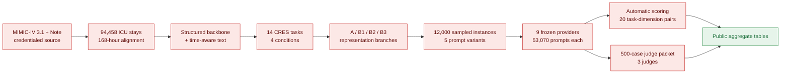

# TIMELY-Bench

**Anchor-bounded clinical temporal reasoning over structured ICU trajectories and clinical text.**

[](https://www.python.org/)
[](https://physionet.org/content/mimiciv/3.1/)
[](REPRODUCIBILITY.md)
[](Makefile)

English | [中文](README_zh.md)

TIMELY-Bench evaluates whether models can reason about *what was known by a
clinical anchor time*, rather than learning from information documented later.
The main V3 benchmark covers AKI, delirium, sepsis, and stroke over a 168-hour
ICU trajectory, structured baselines, five prompt variants, nine frozen LLM
providers, and a three-judge validation study.

> **Reproducibility boundary.** This repository contains the complete public
> methods layer: V3 source code, SQL, schemas, aggregate results, manuscript
> assets, synthetic examples, and release checks. It intentionally does not
> contain MIMIC-IV patient records, patient-level derivatives, filled prompts,
> canonical response JSONL, per-instance scores, or judge rationales.
> Patient-level reconstruction requires independent MIMIC-IV credentials and a
> compliant compute environment. Byte-level verification of the historical
> frozen run additionally requires the controlled derived-artifact package.

## What can be reproduced?

| Goal | GitHub only | Additional requirement |
|---|---:|---|
| Inspect all published aggregate V3 metrics | Yes | None |
| Regenerate the public result summary | Yes | Python 3.10+ |
| Run an end-to-end structural smoke test | Yes | The fictional synthetic fixture |
| Rebuild V3 patient-level artifacts | No | Credentialed MIMIC-IV 3.1/Note access and an approved compute environment |
| Rerun hosted or local LLM inference | No | Controlled filled prompts, provider access or local GPUs, and compliant data handling |
| Recompute the exact frozen scores | No | Controlled canonical responses and per-instance scoring inputs |

Quick links: [V3 data and results](docs/V3_DATA_AND_RESULTS.md) ·
[full reproduction guide](REPRODUCIBILITY.md) ·
[data access](DATA_ACCESS.md) ·
[public artifact policy](PUBLIC_ARTIFACT_POLICY.md) ·
[release metadata](release/v3_public_release.json) ·
[manuscript](paper/npj_digital_medicine/timely_bench_npj_article.pdf)

## Benchmark design



The graph is a provenance map, not an indication that controlled nodes are
downloadable from GitHub. The public tree provides their code, contracts, and
aggregate validation records.

## V3 aggregate data snapshot

| Component | Frozen V3 value | Public evidence |
|---|---:|---|
| ICU stays | **94,458** | [`cohort_v3_meta.json`](results/v3/cohort_v3_meta.json) |
| Subjects | **65,366** | [`cohort_v3_meta.json`](results/v3/cohort_v3_meta.json) |
| Hospital admissions | **85,242** | [`cohort_v3_meta.json`](results/v3/cohort_v3_meta.json) |
| Observation horizon | **168 hours** | [`hourly_state_grid_168h_meta.json`](results/v3/hourly_state_grid_168h_meta.json) |
| Structured backbone | **6,583,285 rows**, 19 parts | [`structured_backbone_hourly_v3_meta.json`](results/v3/structured_backbone_hourly_v3_meta.json) |
| Complete hourly state grid | **15,868,944 rows**, 95 parts | [`hourly_state_grid_168h_meta.json`](results/v3/hourly_state_grid_168h_meta.json) |
| CRES task instances | **4,929,069** | [`cres_master_manifest_summary.json`](results/cres_v3/cres_master_manifest_summary.json) |
| Unique stays eligible for ≥1 CRES task | **66,485** | [`cres_master_manifest_summary.json`](results/cres_v3/cres_master_manifest_summary.json) |

Full-cohort aggregate screening prevalence is 71.86% for AKI, 42.61% for
sepsis, 21.86% for CKD, 12.01% for in-hospital mortality, 11.28% for stroke,
and 7.59% for delirium. These are cohort fields, not anchor-level benchmark
performance or task prevalence.

### Four-condition task inventory

| Condition | Tasks | CRES instances | Unique stays | Scope |
|---|---:|---:|---:|---|
| AKI | 2 | 2,456,896 | 49,920 | Stage 2+ progression and RRT proxy |
| Delirium | 2 | 1,512,502 | 21,628 | Persistence and resolution |
| Sepsis | 2 | 898,560 | 29,713 | Shock progression and lactate clearance |
| Stroke | 8 | 61,111 | 5,318 | Four temporal and four retrospective reasoning tasks |
| **Total / union** | **14** | **4,929,069** | **66,485** | Condition stay sets overlap |

The complete task-by-task definitions, target prevalence, representation
profiles, and row counts are documented in
[`docs/V3_DATA_AND_RESULTS.md`](docs/V3_DATA_AND_RESULTS.md) and the
[`CRES schema`](results/cres_v3/cres_schema_v3.md).

### Representation branches

| Branch | Meaning |
|---|---|
| **A** | Anchor-level statistical summaries over the observed history |
| **B1** | Hourly structured sequence bank with missingness masks |
| **B2** | Time-aware original clinical context; future information is excluded for temporal tasks |
| **B3** | State-vector/state-space representation with an anchor index |

AKI, delirium, and sepsis use `A+B1+B2+B3`; temporal stroke uses `A+B1+B2`;
retrospective stroke uses full-stay `B2` only.

## CRES prompt snapshot

| Item | Value |
|---|---:|
| Sampled task instances | 12,000 |
| Unique sampled stays | 9,587 |
| Prompt rows across all variants | 265,350 |
| Variants | 5 |
| Prompt rows per variant | 53,070 |
| Frozen comparison variant | `full_multimodal` |
| Frozen providers | 9 |
| Canonical frozen responses | 53,070/provider; **477,630 total** |
| Automatically scored rows | 166,019 |
| Automatically supported task–dimension pairs | 20 |

The five variants are `full_multimodal`, `structured_only`, `text_only`,
`no_temporal_markers`, and `shuffled_timeline`. Filled prompt text and row-level
model responses remain controlled MIMIC-derived artifacts.

## Frozen provider results

`Overall macro primary score` is the unweighted macro-average of the designated
primary metric across 20 automatically supported task–dimension pairs. The
underlying metric differs by task type, so this is an evaluation summary rather
than a clinical utility claim.

| Rank | Provider | Tier | Overall macro primary score | Canonical rows / parsed |
|---:|---|---|---:|---:|
| 1 | Gemini 3.1 Pro | Tier 1a | **0.655200** | 53,070 / 53,070 |
| 2 | Gemma 4 26B | Tier 1b | **0.645760** | 53,070 / 53,070 |
| 3 | DeepSeek Chat | Tier 1b | **0.634618** | 53,070 / 53,070 |
| 4 | Qwen 3.5 | Tier 1b | **0.633547** | 53,070 / 53,070 |
| 5 | GPT-5.4 | Tier 1a | **0.625744** | 53,070 / 53,070 |
| 6 | MedGemma 1.5 4B IT | Tier 2 | **0.534534** | 53,070 / 53,070 |
| 7 | Aloe 70B | Tier 2 | **0.519257** | 53,070 / 53,070 |
| 8 | Meditron 3 8B | Tier 2 | **0.510010** | 53,070 / 53,070 |
| 9 | Aloe 7B | Tier 2 | **0.488846** | 53,070 / 53,070 |

Sources: [provider metrics](results/cres_v3/phase65f_frozen_eval/phase65f_provider_metrics.csv),
[per-task metrics](results/cres_v3/phase65f_frozen_eval/phase65f_per_task_dimension_metrics.csv),
[condition heatmap](results/cres_v3/phase65f_frozen_eval/phase65f_condition_heatmap_data.csv),
[stratified metrics](results/cres_v3/phase65f_frozen_eval/phase65f_stratified_metrics.csv), and
[temporal degradation](results/cres_v3/phase65f_frozen_eval/phase65f_temporal_degradation.csv).
The complete frozen-run interpretation is in the
[formal evaluation summary](results/cres_v3/phase65f_frozen_eval/phase65f_formal_summary.md).
`openbiollm70b` is supplementary and excluded from the formal nine-provider comparison.

## Three-judge validation

The fixed packet contains **500 prompt instances**—125 per condition—and four
contestants, yielding **2,000 contestant responses per judge**. Final coverage
is complete for all three judges:

| Judge | Role | Final coverage |
|---|---|---:|
| Claude Opus 4.6 | Primary | 2,000 / 2,000 |
| GPT-5.4 | Cross-check | 2,000 / 2,000 |
| Gemini 3.1 Pro | Cross-check | 2,000 / 2,000 |

All three judges ranked the selected contestants in the same order by mean
overall quality: **GPT-5.4 > DeepSeek Chat > Aloe 70B > MedGemma 1.5 4B IT**.
Across overall quality and clinical correctness, pairwise Spearman correlations
ranged from 0.7188 to 0.8138. GPT-5.4 appears both as a contestant and one
cross-check judge; Claude remains the primary judge and this overlap must be
reported.

**Judge provenance:** CREATE constructed the frozen scoring artifacts and judge
packet. The original CREATE-side Claude attempt failed with provider-side 403
errors. Final three-judge execution, repair, merge, and aggregation were
completed in a synchronized local analysis workspace and archived back to
CREATE on 2026-05-12. See the
[final-sync provenance](results/cres_v3/phase65f_frozen_eval_local_final_sync/phase65f_judge_local_final_sync_provenance.md)
and [aggregate judge summary](results/cres_v3/phase65f_frozen_eval_local_final_sync/phase65f_judge_formal_summary.md).
Machine-readable views are available by
[provider](results/cres_v3/phase65f_frozen_eval_local_final_sync/phase65f_judge_provider_summary.csv),
[condition](results/cres_v3/phase65f_frozen_eval_local_final_sync/phase65f_judge_condition_summary.csv),
and [pairwise agreement](results/cres_v3/phase65f_frozen_eval_local_final_sync/phase65f_judge_pairwise_agreement.csv).

## Repository layout

```text
TIMELY-Bench/
├── code/v3/                    # V3 extraction, construction, inference, scoring
├── code/cres_v3/               # CRES knowledge and mapping utilities
├── scripts/                    # Portable/CREATE orchestration templates
├── sql/                        # Source query definitions
├── results/v3/                 # Public aggregate build metadata
├── results/cres_v3/            # Public schemas and aggregate evaluation results
├── synthetic/                  # Fictional, non-MIMIC structural fixture
├── tools/                      # Result summary and public-release verification
├── tests/public_release/       # Data-boundary and synthetic regression tests
├── release/                    # Machine-readable public release metadata
├── paper/npj_digital_medicine/ # Manuscript, tables, and figures
├── REPRODUCIBILITY.md          # Full staged reproduction tutorial
└── PUBLIC_ARTIFACT_POLICY.md   # Public vs controlled release policy
```

## Reproduction tutorial

### 1. Clone and inspect the aggregate results

Python 3.10 or newer is recommended. Result inspection and release checks use
the standard library and do not require MIMIC-IV access.

```bash
git clone https://github.com/haoyu-haoyu/TIMELY-Bench.git
cd TIMELY-Bench

make inspect-results
```

Expected checkpoints include 94,458 ICU stays, 4,929,069 CRES task rows, nine
providers with 53,070 parsed responses each, and 2,000/2,000 final rows per judge.

For notebook-style exploration:

```bash
python3 -m venv .venv
source .venv/bin/activate               # Windows: .venv\Scripts\activate
python -m pip install --upgrade pip
python -m pip install -r requirements-public.txt

python - <<'PY'
import pandas as pd

path = "results/cres_v3/phase65f_frozen_eval/phase65f_provider_metrics.csv"
providers = pd.read_csv(path).sort_values("overall_macro_primary_score", ascending=False)
print(providers[["provider", "tier", "overall_macro_primary_score"]].to_string(index=False))
PY
```

### 2. Reproduce the synthetic structural test

The synthetic fixture is generated from explicit rules and contains fictional
identifiers, relative times, measurements, and notes. It is not sampled or
paraphrased from MIMIC-IV.

```bash
make reproduce-synthetic
make test
```

This validates the public schema contract across AKI, delirium, sepsis, and
stroke, temporal visibility, task labels, and deterministic golden output.

### 3. Verify the public-release boundary

```bash
make verify-public

# Or run every non-credentialed check:
make public-checks
```

The verifier checks required aggregate artifacts, machine-readable JSON/CSV,
README invariants, prohibited controlled-data patterns, absolute institutional
paths, and common secret formats. Passing this automated gate does not replace
human privacy review or a complete Git-history audit.

### 4. Prepare a credentialed V3 environment

This stage must run in an approved environment. You must independently obtain:

1. PhysioNet credentialed access to MIMIC-IV 3.1 and the applicable Note module;
2. CITI/human-subjects training and signed data agreements;
3. BigQuery-compatible access or equivalent local table exports;
4. approximately 250 GB of working storage, plus temporary space;
5. an institutional Python 3.10+ environment.

Install the portable V3 dependencies:

```bash
python3 -m venv .venv-v3
source .venv-v3/bin/activate
python -m pip install --upgrade pip
python -m pip install -r requirements-v3.txt
```

Configure your own billing and execution settings—do not reuse another
researcher's credentials or project:

```bash
export PROJECT_ROOT="$PWD"
export BQ_BILLING_PROJECT="your-approved-billing-project"
export PYTHON_BIN="python3 -u"
export SOURCE_BATCH_SIZE=5000
export NOTE_BATCH_SIZE=1500
export BATCH_SIZE=5000
export GRID_CHUNK_SIZE=1000
export CONTEXT_STAY_BATCH_SIZE=250
```

First run a bounded smoke extraction:

```bash
bash scripts/run_v3_full_source_refresh_create.sh --stay-limit 100
```

After verifying counts, schemas, note-window boundaries, and output paths in
your controlled environment, run the full source refresh:

```bash
bash scripts/run_v3_full_source_refresh_create.sh
```

The foundation pipeline builds the feature dictionary, BigQuery event/hourly
features, diagnosis pathways, 168-hour grid, condition artifacts, state vectors,
and time-aware contexts. Continue through condition tasks, representations,
state space, CRES assembly, baselines, and prompt construction using the staged
commands in [`REPRODUCIBILITY.md`](REPRODUCIBILITY.md).

### 5. Rebuild CRES and structured baselines

Canonical CREATE/Slurm entrypoints include:

```bash
sbatch scripts/run_phase4d_b1_a_v3.sbatch
sbatch scripts/run_phase5_aki_state_space_v3.sbatch
sbatch scripts/run_phase5_delirium_state_space_v3.sbatch
sbatch scripts/run_phase5_sepsis_state_space_v3.sbatch
sbatch scripts/run_phase6_cres_assembly_v3.sbatch
sbatch scripts/run_phase6_cres_release_v3.sbatch
sbatch scripts/run_phase65a_xgb_v3.sbatch
sbatch scripts/run_phase65a_seq_v3.sbatch
sbatch scripts/run_phase65a_merge_v3.sbatch
sbatch scripts/run_phase65b_prompt_build_v3.sbatch
```

Do not submit downstream stages until their upstream summary JSON reports the
expected schema, row counts, and an empty blocking `flags` list. Exact resource
requests are cluster-specific and should be reviewed before submission.

### 6. Rerun LLM inference and frozen scoring

LLM execution requires the controlled filled-prompt package. Never put MIMIC or
MIMIC-derived prompt content into a service unless its data handling satisfies
your DUA and institutional requirements.

Set only environment-variable references to secrets; never commit values:

```bash
export PROJECT_ROOT="$PWD"
export RESULTS_ROOT="$PROJECT_ROOT/results/cres_v3"
export OUTPUT_DIR="$RESULTS_ROOT/phase65f_frozen_eval"
export HF_HOME="/approved/model/cache"
export VENV="/approved/vllm/environment"
```

The provider-specific templates live under `scripts/run_phase65c_*`,
`scripts/run_phase65d_*`, and `scripts/run_phase65e_*`. Once the nine canonical
response sets are complete, run frozen canonicalization, automatic scoring, and
judge-packet construction:

```bash
bash scripts/run_phase65f_frozen_eval_create.sh
```

This command writes to `OUTPUT_DIR`; do not point it at an archival frozen
directory unless overwriting is explicitly intended. Hosted model outputs can
drift over time. Exact historical score reproduction requires the controlled
frozen canonical responses, not a fresh API rerun.

### 7. Verify the exact restricted release

In the controlled environment, verify at minimum:

- 53,070 unique, parsed canonical rows for each of nine providers;
- an identical prompt-ID set across providers;
- 477,630 total canonical responses;
- 166,019 automatically scored rows and 20 supported task–dimension pairs;
- passing Tier-1a parity;
- 500 judge prompts and 2,000 contestant rows;
- 2,000 successful final outputs for each of three judges;
- whole-file checksums against the approved restricted release manifest.

The public repository cannot perform these row-level checks because the inputs
are intentionally not distributed here. See the
[full staged guide](REPRODUCIBILITY.md) for expected artifacts and troubleshooting.

## Data governance and responsible use

MIMIC-IV is credentialed data. PhysioNet advises treating MIMIC-derived datasets
and models as sensitive and sharing them under the same controlled agreement as
the source data. Accordingly:

- no raw or patient-level derived MIMIC data are tracked here;
- no filled patient prompts, canonical responses, per-instance scores, or judge
  rationales are tracked here;
- synthetic examples are entirely fictional;
- API keys, internal endpoints, absolute user paths, and logs are excluded;
- a future controlled derivative release should use an approved PhysioNet or
  institutional channel.

Read [`DATA_ACCESS.md`](DATA_ACCESS.md),
[`PUBLIC_ARTIFACT_POLICY.md`](PUBLIC_ARTIFACT_POLICY.md), and
[`docs/PUBLIC_RELEASE_CHECKLIST.md`](docs/PUBLIC_RELEASE_CHECKLIST.md) before
publishing a tag or release.

## Known limitations

- The original CREATE account, IAM configuration, and exact execution image
  cannot be redistributed; the repository provides portable requirements and
  execution contracts instead.
- Hosted models, endpoints, and provider-side parsing behavior may change, so a
  fresh inference run is not guaranteed to reproduce frozen text exactly.
- The overall automatic score averages heterogeneous task-appropriate metrics.
- The judge experiment covers four selected contestants, not all nine providers.
- GPT-5.4 is both a contestant and a cross-check judge.
- Aggregate summaries cannot substitute for row-level integrity checks in the
  controlled release.

## Citation

Citation metadata are available in [`CITATION.cff`](CITATION.cff).

```bibtex
@misc{timely-bench-2026,
  title        = {TIMELY-Bench: Anchor-Bounded Clinical Temporal Reasoning over ICU Trajectories and Text},
  author       = {Wang, Haoyu},
  year         = {2026},
  institution  = {King's College London},
  url          = {https://github.com/haoyu-haoyu/TIMELY-Bench}
}
```
