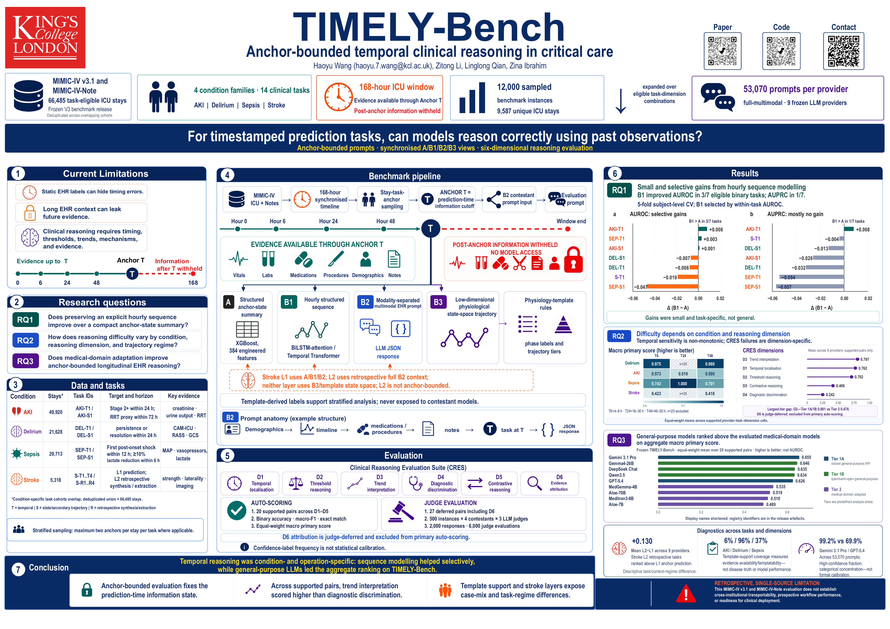
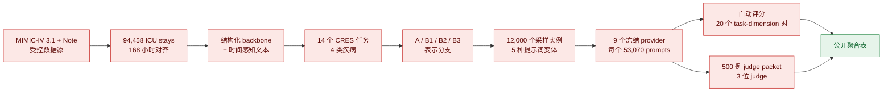

# TIMELY-Bench

**面向结构化 ICU 时序与临床文本的锚点约束临床时序推理基准。**

[](https://www.python.org/)
[](https://physionet.org/content/mimiciv/3.1/)
[](REPRODUCIBILITY.md)
[](Makefile)

[English](README.md) | 中文

TIMELY-Bench 检验模型能否只利用临床锚点时刻之前已经可见的信息进行推理，
避免从未来记录中学习或引用信息。主要 V3 基准覆盖 AKI、谵妄、脓毒症和
卒中四类临床问题，使用 168 小时 ICU 轨迹、结构化基线、四类表示分支、
五种提示词变体、九个冻结 LLM provider，以及三评委验证。

> **复现边界：**本仓库提供完整的公开方法层，包括 V3 源码、SQL、schema、
> 聚合结果、论文材料、纯合成示例和发布检查；不包含 MIMIC-IV 患者记录、
> 患者级衍生表、填充了患者上下文的 prompts、canonical response JSONL、
> 逐实例评分或 judge rationale。患者级重建必须由研究者独立获得 MIMIC-IV
> 权限并在合规计算环境中完成；若要逐字节核对历史冻结运行，还必须取得受控
> 衍生产物包。

## 哪些内容可以复现？

| 目标 | 仅使用 GitHub | 额外要求 |
|---|---:|---|
| 查看并核对所有公开 V3 聚合指标 | 可以 | 无 |
| 重新生成公开结果摘要 | 可以 | Python 3.10+ |
| 运行端到端结构冒烟测试 | 可以 | 仓库内纯虚构合成数据 |
| 重建 V3 患者级数据 | 不可以 | MIMIC-IV 3.1/Note 权限和合规计算环境 |
| 重跑 hosted/local LLM 推理 | 不可以 | 受控 prompts、provider 权限或本地 GPU，以及合规数据处理 |
| 精确复算历史冻结评分 | 不可以 | 受控 canonical responses 和逐实例评分输入 |

快速入口：[V3 数据与结果](docs/V3_DATA_AND_RESULTS.md) ·
[完整复现教程](REPRODUCIBILITY.md) ·
[数据访问说明](DATA_ACCESS.md) ·
[公开发布政策](PUBLIC_ARTIFACT_POLICY.md) ·
[机器可读发布信息](release/v3_public_release.json) ·
[论文 PDF](paper/npj_digital_medicine/timely_bench_npj_article.pdf) ·
[海报 PDF](paper/poster/timely-bench-poster.pdf)

## 学术海报

[](paper/poster/timely-bench-poster.pdf)

海报集中展示了基准设计、评测体系和冻结 V3 结果。点击预览图可打开
A0 高清 PDF。

## 基准流程



红色节点表示受控数据链路，绿色节点表示可公开聚合层。GitHub 提供红色节点
对应的代码、数据合同和聚合验证记录，但不提供其中的患者级内容。

## V3 聚合数据概览

| 项目 | 冻结 V3 数值 | 公开证据 |
|---|---:|---|
| ICU stays | **94,458** | [`cohort_v3_meta.json`](results/v3/cohort_v3_meta.json) |
| Subjects | **65,366** | [`cohort_v3_meta.json`](results/v3/cohort_v3_meta.json) |
| Hospital admissions | **85,242** | [`cohort_v3_meta.json`](results/v3/cohort_v3_meta.json) |
| 观察窗口 | **168 小时** | [`hourly_state_grid_168h_meta.json`](results/v3/hourly_state_grid_168h_meta.json) |
| Structured backbone | **6,583,285 行**，19 parts | [`structured_backbone_hourly_v3_meta.json`](results/v3/structured_backbone_hourly_v3_meta.json) |
| 完整小时状态网格 | **15,868,944 行**，95 parts | [`hourly_state_grid_168h_meta.json`](results/v3/hourly_state_grid_168h_meta.json) |
| CRES 任务实例 | **4,929,069** | [`cres_master_manifest_summary.json`](results/cres_v3/cres_master_manifest_summary.json) |
| 至少进入一个 CRES 任务的 stays 并集 | **66,485** | [`cres_master_manifest_summary.json`](results/cres_v3/cres_master_manifest_summary.json) |

全队列聚合筛查阳性率分别为：AKI 71.86%、脓毒症 42.61%、CKD 21.86%、
院内死亡 12.01%、卒中 11.28%、谵妄 7.59%。这些是 cohort 字段的聚合
分布，不是模型性能，也不同于锚点级任务阳性率。

### 四类疾病与十四个任务

| 疾病 | 任务数 | CRES 实例数 | Unique stays | 主要范围 |
|---|---:|---:|---:|---|
| AKI | 2 | 2,456,896 | 49,920 | Stage 2+ 进展与 RRT proxy |
| 谵妄 | 2 | 1,512,502 | 21,628 | 持续与缓解 |
| 脓毒症 | 2 | 898,560 | 29,713 | 休克进展与乳酸清除 |
| 卒中 | 8 | 61,111 | 5,318 | 4 个时序任务和 4 个回顾性任务 |
| **总计/并集** | **14** | **4,929,069** | **66,485** | 各疾病 stay 集合存在重叠 |

每个任务的定义、标签、阳性率、实例数与表示组合见
[`docs/V3_DATA_AND_RESULTS.md`](docs/V3_DATA_AND_RESULTS.md) 和
[`CRES schema`](results/cres_v3/cres_schema_v3.md)。

### 表示分支

| 分支 | 含义 |
|---|---|
| **A** | 锚点前历史的统计摘要 |
| **B1** | 带缺失掩码的逐小时结构化序列 |
| **B2** | 时间感知原始临床上下文；时序任务排除未来信息 |
| **B3** | 带锚点索引的状态向量/状态空间表示 |

AKI、谵妄、脓毒症使用 `A+B1+B2+B3`；卒中时序任务使用 `A+B1+B2`；
卒中回顾性任务仅使用 full-stay `B2`。

## CRES 提示词概览

| 项目 | 数值 |
|---|---:|
| 采样任务实例 | 12,000 |
| Unique sampled stays | 9,587 |
| 五种变体的 prompts 总数 | 265,350 |
| 提示词变体 | 5 |
| 每种变体 | 53,070 |
| 正式冻结变体 | `full_multimodal` |
| 正式冻结 providers | 9 |
| Canonical responses | 每 provider 53,070；**总计 477,630** |
| 自动评分行数 | 166,019 |
| 可自动评分 task–dimension 对 | 20 |

五种变体为 `full_multimodal`、`structured_only`、`text_only`、
`no_temporal_markers` 和 `shuffled_timeline`。真实填充 prompts 与逐行模型
回答属于受控的 MIMIC 衍生内容，因此不在 GitHub 中发布。

## 九个冻结 provider 的自动评分结果

`Overall macro primary score` 是 20 个可自动评分 task–dimension 对各自主要
指标的非加权宏平均。不同任务使用不同的适合指标，因此不能把这个数字直接解释为
临床效用。

| 排名 | Provider | Tier | Overall macro primary score | Canonical / parsed |
|---:|---|---|---:|---:|
| 1 | Gemini 3.1 Pro | Tier 1a | **0.655200** | 53,070 / 53,070 |
| 2 | [Gemma 4 26B](https://huggingface.co/google/gemma-4-26B-A4B-it) | Tier 1b | **0.645760** | 53,070 / 53,070 |
| 3 | [DeepSeek Chat](https://huggingface.co/deepseek-ai/DeepSeek-V3.2) | Tier 1b | **0.634618** | 53,070 / 53,070 |
| 4 | [Qwen 3.5 35B](https://huggingface.co/Qwen/Qwen3.5-35B-A3B) | Tier 1b | **0.633547** | 53,070 / 53,070 |
| 5 | GPT-5.4 | Tier 1a | **0.625744** | 53,070 / 53,070 |
| 6 | [MedGemma 1.5 4B IT](https://huggingface.co/google/medgemma-1.5-4b-it) | Tier 2 | **0.534534** | 53,070 / 53,070 |
| 7 | [Aloe 70B](https://huggingface.co/HPAI-BSC/Llama3.1-Aloe-Beta-70B) | Tier 2 | **0.519257** | 53,070 / 53,070 |
| 8 | [Meditron 3 8B](https://huggingface.co/EPFLiGHT/Meditron3-8B) | Tier 2 | **0.510010** | 53,070 / 53,070 |
| 9 | [Aloe 7B](https://huggingface.co/HPAI-BSC/Qwen2.5-Aloe-Beta-7B) | Tier 2 | **0.488846** | 53,070 / 53,070 |

Hugging Face 链接指向相应的开放权重模型版本；访问与许可条件以各模型卡为准。
冻结评测中的 DeepSeek 和 Qwen 分别通过托管名称 `deepseek-chat` 与
`qwen3.5-flash` 调用，并非直接在本地运行 Hugging Face 权重。其中 Qwen
对应的公开检查点明确为 **35B-A3B** 版本。

公开结果包括：[provider metrics](results/cres_v3/phase65f_frozen_eval/phase65f_provider_metrics.csv)、
[per-task metrics](results/cres_v3/phase65f_frozen_eval/phase65f_per_task_dimension_metrics.csv)、
[condition heatmap](results/cres_v3/phase65f_frozen_eval/phase65f_condition_heatmap_data.csv)、
[stratified metrics](results/cres_v3/phase65f_frozen_eval/phase65f_stratified_metrics.csv) 和
[temporal degradation](results/cres_v3/phase65f_frozen_eval/phase65f_temporal_degradation.csv)。
完整解释见 [formal evaluation summary](results/cres_v3/phase65f_frozen_eval/phase65f_formal_summary.md)。
`openbiollm70b` 仅作为补充，不进入正式九模型比较。

## 三评委验证

固定 judge packet 包含 **500 个 prompt instances**，四类疾病各 125 个；
四个 contestant 形成每位 judge **2,000 行**评测。最终覆盖为：

| Judge | 角色 | 最终覆盖 |
|---|---|---:|
| Claude Opus 4.6 | Primary | 2,000 / 2,000 |
| GPT-5.4 | Cross-check | 2,000 / 2,000 |
| Gemini 3.1 Pro | Cross-check | 2,000 / 2,000 |

三位 judge 对四个入选 contestant 的平均 overall quality 排序一致：
**GPT-5.4 > DeepSeek Chat > Aloe 70B > MedGemma 1.5 4B IT**。overall quality
与 clinical correctness 的 pairwise Spearman ρ 为 0.7188–0.8138。
GPT-5.4 同时是 contestant 和 cross-check judge，Claude 仍是 primary judge；
报告时必须披露这个重叠。

**Judge 来源：**CREATE 构建了冻结自动评分产物和 judge packet。CREATE 上最初的
Claude 调用因 provider-side 403 失败；最终三评委执行、修复、合并与聚合在同步的
本地分析工作区中完成，并在 2026-05-12 回同步到 CREATE 归档。见
[final-sync provenance](results/cres_v3/phase65f_frozen_eval_local_final_sync/phase65f_judge_local_final_sync_provenance.md)
和 [judge aggregate summary](results/cres_v3/phase65f_frozen_eval_local_final_sync/phase65f_judge_formal_summary.md)。
机器可读聚合表按 [provider](results/cres_v3/phase65f_frozen_eval_local_final_sync/phase65f_judge_provider_summary.csv)、
[condition](results/cres_v3/phase65f_frozen_eval_local_final_sync/phase65f_judge_condition_summary.csv)
及 [pairwise agreement](results/cres_v3/phase65f_frozen_eval_local_final_sync/phase65f_judge_pairwise_agreement.csv) 提供。

## 仓库结构

```text
TIMELY-Bench/
├── code/v3/                    # V3 提取、构建、推理与评分代码
├── code/cres_v3/               # CRES knowledge 与映射工具
├── scripts/                    # 通用/CREATE 调度模板
├── sql/                        # 源查询定义
├── results/v3/                 # 公开聚合构建元数据
├── results/cres_v3/            # 公开 schema 与聚合评测结果
├── synthetic/                  # 纯虚构、非 MIMIC 的结构测试数据
├── tools/                      # 结果摘要与公开发布校验
├── tests/public_release/       # 数据边界和合成数据回归测试
├── release/                    # 机器可读公开发布信息
├── paper/npj_digital_medicine/ # 论文、表格与图片
├── paper/poster/               # A0 海报 PDF 与 README 预览图
├── REPRODUCIBILITY.md          # 完整分阶段复现教程
└── PUBLIC_ARTIFACT_POLICY.md   # 公开与受控发布边界
```

## 详细复现教程

### 第一步：克隆并核对公开聚合结果

推荐 Python 3.10 或更高版本。结果核对与发布检查不需要 MIMIC-IV 权限。

```bash
git clone https://github.com/haoyu-haoyu/TIMELY-Bench.git
cd TIMELY-Bench
make inspect-results
```

预期输出应包含：94,458 ICU stays、4,929,069 CRES 任务行、九个 provider 各
53,070 个解析成功的 canonical rows，以及三位 judge 各 2,000/2,000 行。

如需用 pandas 进一步检查：

```bash
python3 -m venv .venv
source .venv/bin/activate               # Windows: .venv\Scripts\activate
python -m pip install --upgrade pip
python -m pip install -r requirements-public.txt

python - <<'PY'
import pandas as pd

path = "results/cres_v3/phase65f_frozen_eval/phase65f_provider_metrics.csv"
df = pd.read_csv(path).sort_values("overall_macro_primary_score", ascending=False)
print(df[["provider", "tier", "overall_macro_primary_score"]].to_string(index=False))
PY
```

### 第二步：运行纯合成端到端结构测试

合成 fixture 使用虚构 ID、相对时间、虚构测量与 notes，由显式规则生成，
没有采样、移动或改写任何 MIMIC-IV 记录。

```bash
make reproduce-synthetic
make test
```

该步骤验证 AKI、谵妄、脓毒症和卒中的公开 schema 合同、时序可见性、
任务标签与 deterministic golden output。

### 第三步：检查公开发布边界

```bash
make verify-public

# 一次运行全部不需要受控数据的检查：
make public-checks
```

校验器检查必须存在的聚合产物、JSON/CSV 可读性、README 核心数字、禁入的
受控数据模式、绝对机构路径和常见 secret 格式。自动检查通过不等于已经完成
人工隐私审查，也不能替代完整 Git 历史检查。

### 第四步：准备有权限的 V3 环境

这一阶段只能在批准的环境中运行。研究者需独立获得：

1. PhysioNet MIMIC-IV 3.1 和适用 Note 模块的 credentialed access；
2. CITI/人类受试者培训和相应 DUA；
3. BigQuery-compatible access 或等价的本地表；
4. 约 250 GB 工作空间及额外临时空间；
5. 机构批准的 Python 3.10+ 环境。

安装可移植 V3 依赖：

```bash
python3 -m venv .venv-v3
source .venv-v3/bin/activate
python -m pip install --upgrade pip
python -m pip install -r requirements-v3.txt
```

配置自己的 billing 与执行参数，不能复用其他研究者的账号或 credentials：

```bash
export PROJECT_ROOT="$PWD"
export BQ_BILLING_PROJECT="your-approved-billing-project"
export PYTHON_BIN="python3 -u"
export SOURCE_BATCH_SIZE=5000
export NOTE_BATCH_SIZE=1500
export BATCH_SIZE=5000
export GRID_CHUNK_SIZE=1000
export CONTEXT_STAY_BATCH_SIZE=250
```

先做 100 stays 的受控冒烟测试：

```bash
bash scripts/run_v3_full_source_refresh_create.sh --stay-limit 100
```

确认 schemas、行数、note 时间窗和输出位置正确后再运行完整刷新：

```bash
bash scripts/run_v3_full_source_refresh_create.sh
```

该 foundation pipeline 会构建 feature dictionary、BigQuery event/hourly
features、diagnosis pathways、168 小时网格、condition artifacts、state vectors
和 time-aware contexts。后续 condition tasks、representations、state space、
CRES、baseline 与 prompt 构建详见 [`REPRODUCIBILITY.md`](REPRODUCIBILITY.md)。

### 第五步：构建 CRES 与结构化基线

CREATE/Slurm 的主要入口包括：

```bash
sbatch scripts/run_phase4d_b1_a_v3.sbatch
sbatch scripts/run_phase5_aki_state_space_v3.sbatch
sbatch scripts/run_phase5_delirium_state_space_v3.sbatch
sbatch scripts/run_phase5_sepsis_state_space_v3.sbatch
sbatch scripts/run_phase6_cres_assembly_v3.sbatch
sbatch scripts/run_phase6_cres_release_v3.sbatch
sbatch scripts/run_phase65a_xgb_v3.sbatch
sbatch scripts/run_phase65a_seq_v3.sbatch
sbatch scripts/run_phase65a_merge_v3.sbatch
sbatch scripts/run_phase65b_prompt_build_v3.sbatch
```

上游 summary JSON 未达到预期 schema/行数，或 `flags` 中存在阻断项时，
不要提交下游阶段。资源请求与路径需按目标集群重新审核。

### 第六步：重跑 LLM 与冻结评分

LLM 推理需要受控的 filled-prompt 包。除非服务的数据处理方式符合 DUA 与
机构要求，否则不能向第三方服务发送 MIMIC 或其衍生 prompt 内容。

所有 secret 只能用环境变量引用，不能把值提交到 Git：

```bash
export PROJECT_ROOT="$PWD"
export RESULTS_ROOT="$PROJECT_ROOT/results/cres_v3"
export OUTPUT_DIR="$RESULTS_ROOT/phase65f_frozen_eval"
export HF_HOME="/approved/model/cache"
export VENV="/approved/vllm/environment"
```

Provider 模板位于 `scripts/run_phase65c_*`、`scripts/run_phase65d_*` 和
`scripts/run_phase65e_*`。九个 canonical response 集完整后，运行：

```bash
bash scripts/run_phase65f_frozen_eval_create.sh
```

该命令会写入 `OUTPUT_DIR`；除非明确希望覆盖，不要把它指向归档冻结目录。
Hosted model 输出会随时间漂移；精确历史复现依赖受控 canonical responses，
不能用新的 API rerun 替代。

### 第七步：在受控环境验证精确冻结包

至少检查：

- 九个 provider 各 53,070 个 unique、解析成功的 canonical rows；
- 各 provider 的 prompt-ID 集合完全一致；
- canonical responses 总计 477,630；
- 自动评分 166,019 行、20 个支持的 task–dimension 对；
- Tier-1a parity 通过；
- judge prompts 500 个、contestant rows 2,000 个；
- 三位 judge 的最终成功输出各 2,000 行；
- 所有文件与批准的受控 release checksum 一致。

GitHub 不包含这些逐行输入，因此不能在公开环境执行上述逐实例验证。
预期产物和故障排查见 [完整分阶段复现教程](REPRODUCIBILITY.md)。

## 数据治理与负责任使用

MIMIC-IV 是 credentialed data。PhysioNet 建议将 MIMIC 衍生数据集和模型视为
敏感内容，并在与源数据相同的受控协议下分享。因此本仓库：

- 不跟踪 raw 或 patient-level derived MIMIC 数据；
- 不跟踪 filled prompts、canonical responses、逐实例 scores 或 judge rationales；
- 合成示例完全虚构；
- 排除 API keys、内部 endpoints、绝对用户路径和日志；
- 未来的受控衍生发布应使用经批准的 PhysioNet 或机构渠道。

发布前请阅读 [`DATA_ACCESS.md`](DATA_ACCESS.md)、
[`PUBLIC_ARTIFACT_POLICY.md`](PUBLIC_ARTIFACT_POLICY.md) 和
[`docs/PUBLIC_RELEASE_CHECKLIST.md`](docs/PUBLIC_RELEASE_CHECKLIST.md)。

## 已知限制

- 原 CREATE 账号、IAM 与精确执行镜像无法公开，仓库提供可移植依赖和执行合同。
- Hosted model、endpoint 与 provider parser 会变化，新推理不能保证逐字复现冻结文本。
- Overall automatic score 聚合了不同任务使用的不同指标。
- Judge 实验只覆盖四个入选 contestant，并非全部九个 provider。
- GPT-5.4 同时是 contestant 和 cross-check judge。
- 聚合 summary 不能替代受控包中的逐行完整性检查。

## 引用

软件发布的机器可读引用信息位于 [`CITATION.cff`](CITATION.cff)。
请根据实际使用内容引用论文和软件发布。
